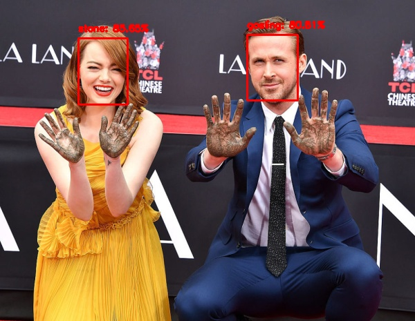
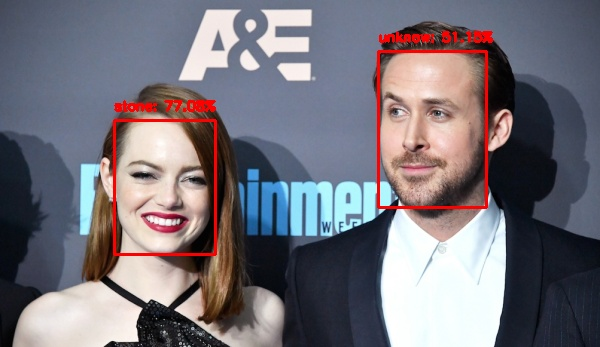
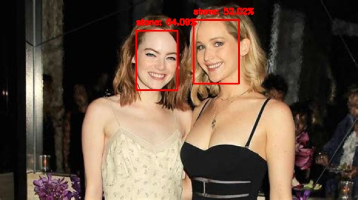
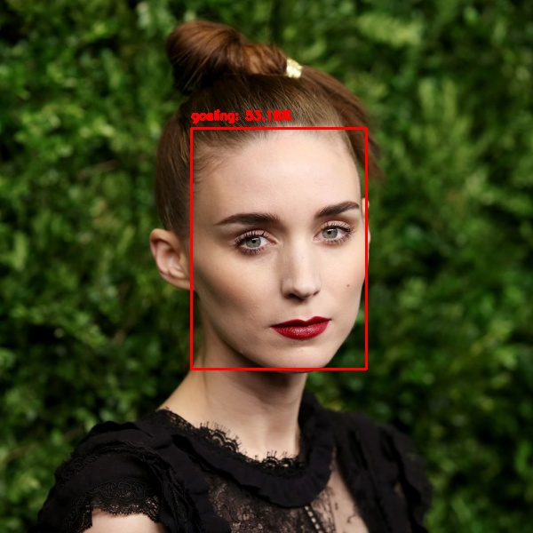
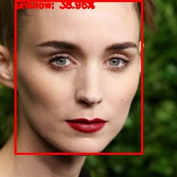

# Case study : facial detection and recognition with Python

This repository contains a work made for a Computer Vision course at the *Ecole Centrale de Lille*.

Its aim is to detect and recognize each face, firstly of an image, then of a video.
As an example, I used pictures of celebrities.



This repository contains:
* a `extract_embeddings.py` script to extract embeddings from the dataset,
* a `train_model.py` script to train the SVM model to classify the subjects,
* a `recognize.py` script to run the model on an image,
* a `test_model.py` script to run the model on multiple images (almost strict copy of the previous script), 
* an `/assets` folder where one can find the models used for embeddings extractions and the face_alignment.py script imported in the main scripts,
* an `/output` folder where the trained model, labels and extracted embeddings are stored by default (the user will find my own files for him to test the recognize.py script).

First of all, the user must install the needed libraries by running the command line:
```sh
$ pip install -r requirements.txt
```

Each of the scripts are to be runned using the command line:
```sh
$ python path/to/script.py --args
```

and all the arguments are described with the command line:
```sh
$ python path/to/script.py --help
```

## Test the model

The user can use the `test_model.py` script to...test his model (or the one I provided) on his own images. This folder must have a precise structure:

***Into the `/test` folder, put one folder for each person to be detected and name it after the same label as the one used by the model.***

The testing dataset I used is unbalanced as the main trouble seems to be false positives, so there are more "unknown" persons in the dataset. But I tried to gather some look-alikes, like Johannes Laschet for testing the Ryan Gosling's class accuracy (and the same for Emma Stone).

## News

In this section I will write the different steps of my work.

### Firstly 

I started with a simple database containing 30 pictures of Emma Stone, as much of Ryan Gosling, and 30 pictures of different celebrities labeled as "unknown". The `extract_embeddings.py` script firstly creates embeddings, which are vectors describing the "face's properties", then a Support Vector Machine model is trained to classify the celebrities.
It shows some good results (see the example above), but there are some errors : the results seem to be quite sensitive to the face's alignment.



Moreover, the model seems to struggle more with female faces, as quite a lot of female "unknown" faces are classified as Emma Stone's.



In the future, I shall expand my database for each class and implement a face alignment script to tackle the related trouble.

### Secondly

After having implemented a `face_alignment.py` program, I trained the model and run the tests on a total of 45 images:

|True positive|True negative|False positive|False negative|
| :----- | :----: | :----: | ------:|
| 28.8 % | 37.8 % | 17.8 % | 15.6 % |

As the results seems to be better, I've encountered some unusual behaviour: some female faces have been detected as Ryan Gosling's.



I will now search for more data to train the model and run another test.

***Edit: My testing program was wrong, because the input faces were not aligned. I corrected this and the above false result disappeared:***



### Thirdly

After adding 10 pictures of both Emma Stone and Ryan Gosling, I trained the model again. Moreover, I modified the `face_alignment.py` script, as it induced a face detection on the already detected face given as input. Here are the results on the same testing data as previously:

True positive|True negative|False positive|False negative|
| :----- | :----: | :---: | ------:|
| 26.6 % | 53.3 % | 2.1 % | 17.7 % |

There are less true and false positives than before, mostly because the dataset is unbalanced and the model became more _sensitive_ to our actors, it results on better "unknown" predictions but less true positives.

***Edit: I added a couple more pictures of "unknown", re-trained the model and got these results:***

|True positive|True negative|False positive|False negative|
| :----- | :----: | :---: | ------:|
| 44.4 % | 40 % | 15.6 % | 0 % (!!) |

***The model seems to be working quite well, having an accuracy of about 85%. I will try to get even more data to see if it can be improved.***

### Fourthly

After expanding a little bit both my training and testing dataset, I tried different classifiers in the `train_model.py` script:

|          Method          |Accurary|
| :----------------------- | -----: |
|            SVC           | 82.6 % |
|         AdaBoost         | 78.3 % |
|      Gaussian Process    | 78.2 % |
| SVC with gamma parameter | 84.8 % |

The training dataset is : 11 elements of Gosling, 12 elements of Stone, 23 elements of unknow.
It seems that the last method does better results. It tested different parameters of gamma:

|  Gamma value   |Accurary|
| :------------- | -----: |
| 'scale' (auto) | 84.8 % |
|      0.1       | 73.9 % |
|       2        | 84.8 % |
|       10       | 84.8 % |
|      100       | 26.1 % |

I chose to stay with the automatic mode, but I'll need to do more tests if the dataset is changed.

***Edit: I added an export option in the test_model.py script to see where the errors are, and the only errors are false positives on female faces. Even if there are already more images of women in the "unknow" dataset and in the Emma Stone's, it seems that I need to gather even more.***

## Credits

This code has been implemented based on [this tutorial](https://www.pyimagesearch.com/2018/09/24/opencv-face-recognition/) written by [Adrian Rosebrock](https://github.com/jrosebr1), whose very good content has been quite helpful for me.