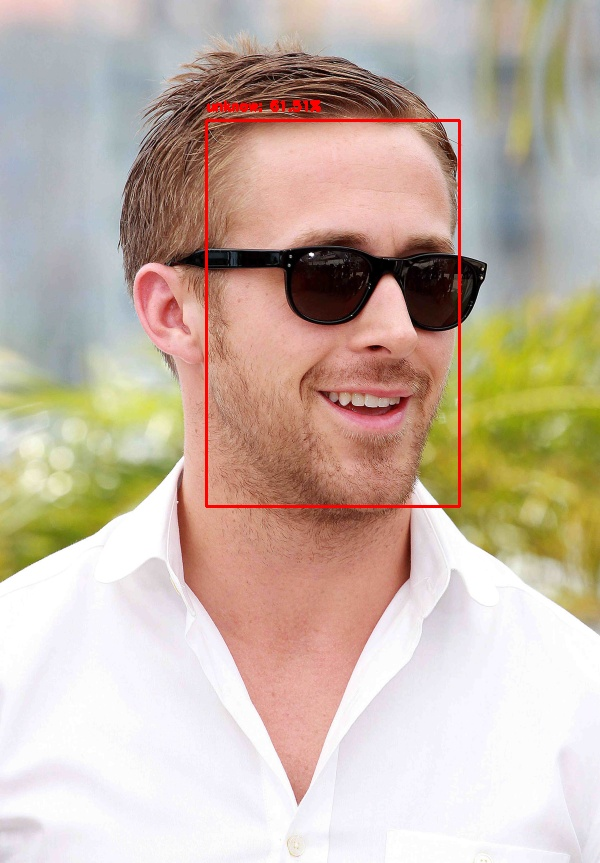
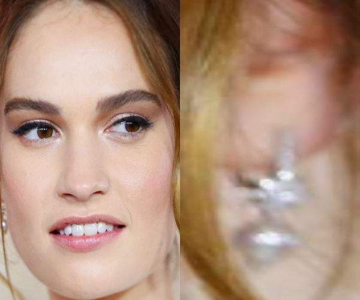

# Case study : facial detection and recognition with Python

This repository contains a work made for a Computer Vision course at the *Ecole Centrale de Lille*.

Its aim is to detect and recognize each face, firstly of an image, then of a video.
As an example, I used pictures of celebrities.


This repository contains:
* a `extract_embeddings.py` script to extract embeddings from the dataset,
* a `train_model.py` script to train the SVM model to classify the subjects,
* a `recognize.py` script to run the model on an image,
* a `test_model.py` script to run the model on multiple images (almost strict copy of the previous script), 
* an `/assets` folder where one can find the models used for embeddings extractions and the face_alignment.py script imported in the main scripts,
* an `/output` folder where the trained model, labels and extracted embeddings are stored by default (the user will find my own files for him to test the `recognize.py` script).

First of all, the user must install the needed libraries by running the command line:
```sh
$ pip install -r requirements.txt
```

Each of the scripts are to be runned using the command line:
```sh
$ python path/to/script.py --args
```

and all the arguments are described with the command line:
```sh
$ python path/to/script.py --help
```

## Test the model

To run those scripts, I use Python 3.8.3.

The user can use the `test_model.py` script to... test his model ! (or the one I provided) on his own images. This folder must have a precise structure:

***Into the `/test` folder, put one folder for each person to be detected and name it after the same label as the one used by the model.***

The testing dataset I used is unbalanced as the main trouble seems to be false positives, so there are more "unknow" persons in the dataset.

## News

In this section I will write the different steps of my work.

### Firstly 

I started with a simple database containing 30 pictures of Emma Stone, as much of Ryan Gosling, and 30 pictures of different celebrities labeled as "unknow". The `extract_embeddings.py` script firstly creates embeddings, which are vectors describing the "face's properties", then a Support Vector Machine model is trained to classify the celebrities.
It shows some good results (see the example above), but there are some errors : the results seem to be quite sensitive to the face's alignment.


Moreover, the model seems to struggle more with female faces, as quite a lot of female "unknow" faces are classified as Emma Stone's.


In the future, I shall expand my database for each class and implement a face alignment script to tackle the related trouble.

### Secondly

After having implemented a `face_alignment.py` program, I trained the model and ran tests on a total of 45 images:

|True positive|True negative|False positive|False negative|
| :----- | :----: | :----: | ------:|
| 28.8 % | 37.8 % | 17.8 % | 15.6 % |

As the results seems to be better, I've encountered some unusual behaviour: some female faces have been detected as Ryan Gosling's.


I will now search for more data to train the model and run another test.

***Edit: My testing program was wrong, because the input faces were not aligned. I corrected this and the above false result disappeared:***


### Thirdly

After adding 10 pictures of both Emma Stone and Ryan Gosling, I trained the model again. Moreover, I modified the `face_alignment.py` script, as it induced a face detection on the already detected face given as input. Here are the results on the same testing data as previously:

True positive|True negative|False positive|False negative|
| :----- | :----: | :---: | ------:|
| 26.6 % | 53.3 % | 2.1 % | 17.7 % |

There are less true and false positives than before, mostly because the dataset is unbalanced and the model became more _sensitive_ to our actors, it results on better "unknow" predictions but less true positives.

***Edit: I added a couple more pictures of "unknow", re-trained the model and got these results:***

|True positive|True negative|False positive|False negative|
| :----- | :----: | :---: | ------:|
| 44.4 % | 40 % | 15.6 % | 0 % (!!) |

***The model seems to be working quite well, having an accuracy of about 85%. I will try to get even more data to see if it can be improved.***

### Fourthly

After expanding a little bit both my training and testing dataset, I tried different classifiers in the `train_model.py` script:

|          Method          |Accurary|
| :----------------------- | -----: |
|            SVC           | 82.6 % |
|         AdaBoost         | 78.3 % |
|      Gaussian Process    | 78.2 % |
| SVC with gamma parameter | 84.8 % |

The training dataset is: 11 elements of Gosling, 12 elements of Stone, 23 elements of "unknow".
It seems that the last method does better results, so I tested different parameters for gamma:

|  Gamma value   |Accurary|
| :------------- | -----: |
| 'scale' (auto) | 84.8 % |
|      0.1       | 73.9 % |
|       2        | 84.8 % |
|       10       | 84.8 % |
|      100       | 26.1 % |

I chose to stay with the automatic mode, but I'll need to do more tests if the dataset is changed.

***Edit: I added an export option in the `test_model.py` script to see where the errors are, and the only errors are false positives on female faces. Even if there are already more images of women in the "unknow" dataset and in the Emma Stone's, it seems that I need to gather even more.***

### Fifthly

I tried a different deep learning model for embeddings extractions and chose the [VGG-Face implemented for Keras](https://gist.github.com/EncodeTS/6bbe8cb8bebad7a672f0d872561782d9), using the weights one can find [here](https://drive.google.com/u/0/uc?export=download&confirm=zeP8&id=1CPSeum3HpopfomUEK1gybeuIVoeJT_Eo) (external from GitHub). I modified `extract_embeddings.py`, `test_model.py` and `recognize.py` files to handle this model: the user must put the `-m keras` argument in the command line to use it. ***Be careful that the embeddings are not the same shapes as previously (128-D vector with OpenCV and 2622-D vector with VGG-Face) so if one extracts the faces embeddings with Keras, one MUST choose this Keras option again with the `test_model.py` script in order to avoïd a shape error.***

Moreover, I expanded my dataset, which is now composed with : 50 pictures of Ryan Gosling, 100 pictures of Emma Stone and 60 pictures of "unknow". The new test gave the following results (on the same testing dataset):

|True positive|True negative|False positive|False negative|
| :----- | :----: | :---: | ------:|
| 50 % | 39.1 % | 10.9 % | 0 % |

So an overall accuracy of 89.1 %, which is better than previously ! A drawback though: even with GPU computation with Tensorflow, the extracting process takes longer than with OpenCV with 0.63 FPS on the test, compared to 0.68 FPS with OpenCV's embeddings extractor (without using GPU).

### Sixthly

I expanded my training and testing dataset again and implemented a filter for the embeddings classification: if the probability returned by the classifier is below the `--confidence` threshold, the face becomes "unknow". After some tests, I finally managed to obtain 100% accuracy (no errors on the testing dataset containing 20 images of Stone, 20 images of Gosling and 60 images of "unknow") with a confidence parameter of 0.8.
The major drawback of this filter is that it seems to be effective over 0.8 to get rid of the look-alikes, but when the subject wears sunglasses, the program's confidence tends to decrease and gets below the threshold, thus generating a false negative.



### Seventhly

I changed my dataset for my program to recognize a new atress: Lily James. So I added 70 pictures of her, and decreased the number of Emma Stone and Ryan Gosling's images to the same number. Additionnaly, I have now 100 pictures of 'unknow' (each different celebrities).

As for my testing data, I have 50 images of Stone, Gosling and James each, and 130 of 'unknow' (celebrities, sometines a few images of the same).

I also implemented a new script which can be found in the `./assets` folder to perform a `dataset_clean_test.py`. This script is to be run with the command line:

```sh
$ python dataset_clean_test.py --dataset path/to/dataset
```

and browse all the images of the dataset counting how many faces it finds on each.

Since it is assumed that, for a training or testing dataset, each image shows only one face, if the program finds more it will display all the incriminated file at the end of execution.

I came across this error, which implied a wrong result during testing:

```
INFO:root:Loading detector and images...
INFO:root:Beginning face detections...
Progress 280 out of 280
INFO:root:Face detections ended.
WARNING:root:Dataset not clean, try to increase the weight/height filter or change the incriminated files:

 ERROR file .\test\james\james015.jpg, 2 faces detected !

INFO:root:Program ended within 19.26 seconds.
```



The error here was with Lily James' earring, but it can be other faces in the background for example.

To finish, I added a new `config.py` file for the user to set his global variables (like the embeddings method) easier.

After re-training the model and testing it, I obtained the following results (*metrics changed, the percentages here are not just relative to the total number of images, but represents the proportion of positive/negative answers that are actually correct):

|True positive|True negative|False positive|False negative|
| :---------- | :---------: | :----------: | ------------:|
|    98.7 %   |    100 %    |      0 %     |     1.3 %    |

and an overall accuracy (proportion of true positives true negatives, same as before) of 99.3 %.

***Edit: comparison with OpenCV's embeddings extractor: re-training my model with the 128-D embeddings extracted by the OpenCV's method, I have the following test results:***

|True positive|True negative|False positive|False negative|
| :---------- | :---------: | :----------: | ------------:|
|    53.3 %   |    91.5 %   |     8.5 %    |    46.7 %    |

***and an overall accuracy of 71.1 %. It is not bad, but with this method the model seems to need more training data as there are a lot of false negatives. In addition, it isn't a lot faster than Keras, one just saves the starting time of Tensorflow.***

## Credits

This code has been implemented based on [this tutorial](https://www.pyimagesearch.com/2018/09/24/opencv-face-recognition/) written by [Adrian Rosebrock](https://github.com/jrosebr1), whose very good content has been quite helpful for me.